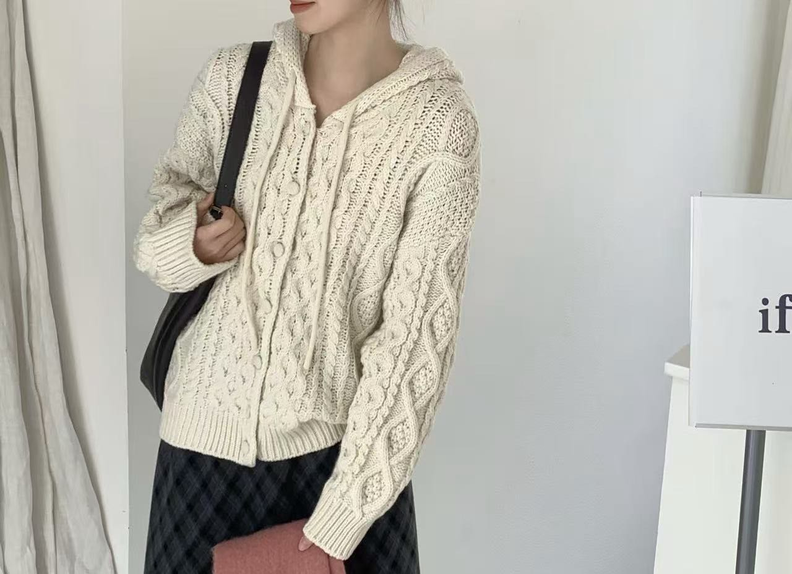

# 款10 粗针麻花连帽开衫 · 操作单

> 打版日期：______ | 打版师：______ | 定价：¥109

## 📷 参考图


---

## 1. 基础信息

| 项目 | 内容 |
|------|------|
| 款号 | 10 |
| 款式名 | 粗针麻花连帽开衫 |
| 品类 | 设计差异 |
| 定价 | ¥109 |
| 针型 | **5G（3.5mm）粗针** |
| 风格 | 韩系慵懒休闲，松软立体 |

---

## 2. 尺码尺寸表（cm）

| 部位 | S | M | L | 公差 |
|------|:--:|:--:|:--:|:--:|
| 衣长 | 60 | 62 | 64 | ±1 |
| 胸围（平铺×2） | 100 | 106 | 112 | ±2 |
| 肩宽 | 48 | 50 | 52 | ±1 |
| 袖长（腋下→袖口） | 58 | 59 | 60 | ±1 |
| 下摆宽 | 90 | 94 | 98 | ±1 |
| 帽高 | 34 | 35 | 36 | ±1 |
| 帽宽 | 26 | 27 | 28 | ±1 |
| 袖口宽 | 10 | 11 | 12 | ±0.5 |
| 适合身高 | 155-162 | 160-168 | 165-173 | |
| 适合体重(kg) | 45-52 | 52-60 | 60-68 | |

---

## 3. 针法排布

| 部位 | 针法 | 针距 | 备注 |
|------|------|:--:|------|
| 前片左 | 3针1股麻花×2条 + 上针底 | 5G | 麻花距门襟5cm，间距4cm |
| 前片右 | 同左，镜像 | 5G | |
| 后片 | 上针（反针）打底 | 5G | 无麻花，简洁 |
| 袖子 | 上针 + 袖中1条麻花 | 5G | 麻花延伸至袖口上方15cm |
| 帽片 | 平针 | 5G | 双层帽檐 |
| 前门襟 | 2×2 罗纹，宽4cm | 5G | V形开襟 |
| 袖口 | 2×2 罗纹，高6cm | 5G | |
| 下摆 | 2×2 罗纹，高7cm | 5G | |

### 麻花参数

| 参数 | 数值 |
|------|------|
| 股数 | 3针1股 |
| 绞花周期 | 每6行一绞 |
| 前片麻花数 | 每侧2条，共4条 |
| 绞法 | 第4行左交叉，第5行右交叉，第6行复位 |

```
前片示意（左片）：
┌──────────────────┐
│ ═══  ═══        │ ← 麻花×2
│ ═══  ═══        │   间距4cm
│ ░░░░░░░░░░░░░░  │ ← 上针底
│ ░░░░░░░░░░░░░░  │
│ ░░░░░░░░░░░░░░  │
│ ░░░░░░░░░░░░░░  │
│ ▓▓▓▓▓▓▓▓▓▓▓▓▓  │ ← 门襟2×2罗纹4cm
└──────────────────┘
```

---

## 4. 门襟与纽扣

| 项目 | 规格 |
|------|------|
| 门襟类型 | V形开襟，装饰纽扣（不实际扣合） |
| 纽扣 | 半圆形树脂扣，直径1.6cm |
| 纽扣数量 | 5粒 |
| 纽扣间距 | 12cm |
| 纽扣颜色 | 米白色（通用）或同衣身色 |
| 帽绳 | 同色双股编织绳，末端打结 |

---

## 5. 纱线采购单

| 色号 | 颜色 | 支数 | 成分 | M码用量 | 首批3色×3码=9件 |
|------|------|:--:|------|:--:|------|
| YN-01 | 燕麦 | 2.5Nm | 羊毛混纺 | 500g | 4.5kg |
| KK-02 | 可可棕 | 2.5Nm | 羊毛混纺 | 500g | 4.5kg |
| 🆕 TT-01 | 陶土色 | 2.5Nm | 羊毛混纺 | 500g | 4.5kg |
| **合计** | 3色 | | | | **13.5kg** |

> 粗针用Nm支数（公支）。2.5Nm ≈ 纱线直径4-5mm，适合5G针型

---

## 6. 辅料清单

| 辅料 | 规格 | 每件 | 9件 | 
|------|------|:--:|:--:|
| 装饰纽扣 | 1.6cm米白树脂 | 5粒 | 45粒 |
| 帽绳 | 同色双股编织 | 1条 | 9条 |
| 主唛 | TEMPL 玄 | 1 | 9 |
| 洗水唛 | 成分+洗护 | 1 | 9 |
| 吊牌 | ¥109 | 1套 | 9套 |

---

## 7. 工艺要点

| 工序 | 要点 | 注意 |
|------|------|------|
| 织片 | 麻花6行一绞，别绞太紧 | 绞花时手动松2mm |
| 帽子 | 先织帽片再与领口套口 | 帽檐双层对折缝合 |
| 门襟 | V形开襟织罗纹带 | 注意左右对称 |
| 钉扣 | 只钉装饰，不锁扣眼 | 扣位对齐门襟中线 |
| 洗水 | 冷水轻柔洗 | 不甩干，平铺晾 |
| 整烫 | 低温蒸汽 | 麻花处垫布，别压扁 |

---

## 8. 质检项

| 检查项 | 标准 | ✅ |
|------|------|:--:|
| 麻花状态 | 立体饱满，不扁不塌 | ⬜ |
| 左右对称 | 偏差≤0.5cm | ⬜ |
| 帽子服帖 | 不歪不扭 | ⬜ |
| 纽扣端正 | 5粒对齐 | ⬜ |
| 无跳针漏针 | 全检 | ⬜ |
| 尺寸合格 | S/M/L对照表 | ⬜ |
| 手感 | 松软不扎 | ⬜ |

---

> 📁 `2026开发素材库/已入线款式/款10_粗针麻花开衫/操作单.md`
