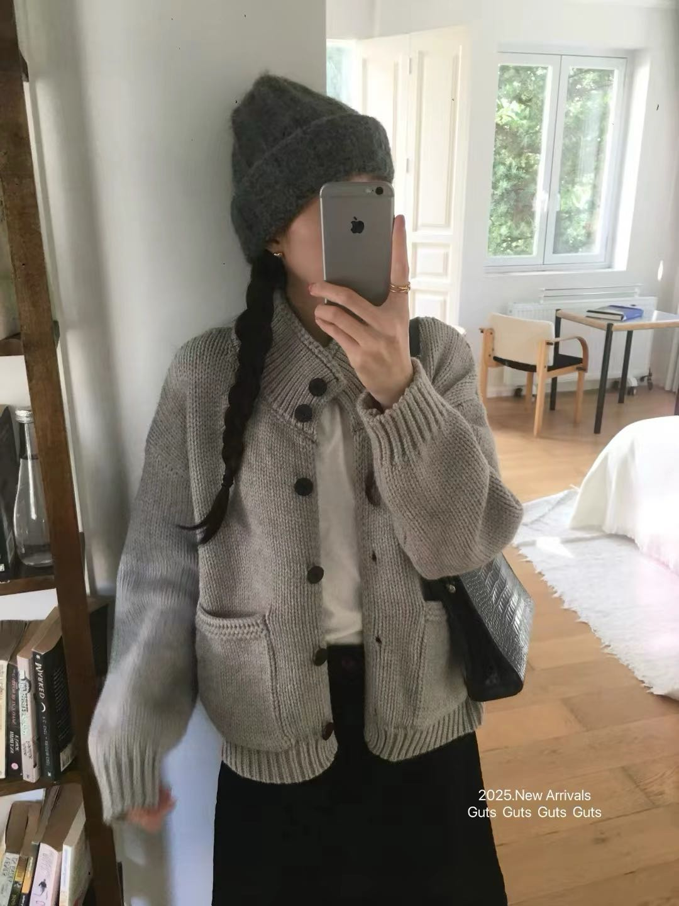

# 款12 A字收腰粗针针织衫 · 操作单

> 打版日期：______ | 打版师：______ | 定价：¥109

## 📷 参考图

---

## 1. 基础信息

| 项目 | 内容 |
|------|------|
| 款号 | 12 |
| 款式名 | A字收腰粗针针织衫 |
| 品类 | 设计差异 |
| 定价 | ¥109 |
| 针型 | **5G（3.5mm）粗针** |
| 风格 | 韩系极简，短款A字廓形 |

---

## 2. 尺码尺寸表（cm）

| 部位 | S | M | L | 公差 |
|------|:--:|:--:|:--:|:--:|
| 衣长 | 42 | 44 | 46 | ±1 |
| 胸围（平铺×2） | 88 | 94 | 100 | ±2 |
| 腰围（最细处） | 72 | 78 | 84 | ±1 |
| 下摆宽 | 96 | 102 | 108 | ±1 |
| 肩宽 | 38 | 40 | 42 | ±1 |
| 袖长（腋下→袖口） | 56 | 57 | 58 | ±1 |
| 袖口宽 | 8 | 8.5 | 9 | ±0.5 |
| 适合身高 | 155-162 | 160-168 | 165-173 | |
| 适合体重(kg) | 42-50 | 50-58 | 58-65 | |

---

## 3. 版型要点

| 特征 | 说明 |
|------|------|
| 廓形 | **A字**：肩胸合体 → 腰收紧 → 下摆散开 |
| 收腰方式 | 两侧罗纹收腰带，宽3cm |
| 衣长 | **短款**，约及腰线 |
| 领型 | V领，深约8cm |
| 门襟 | 单排扣，4粒纽扣 |
| 口袋 | 两侧贴袋，袋口罗纹收边 |

---

## 4. 针法排布

| 部位 | 针法 | 针距 | 备注 |
|------|------|:--:|------|
| 前片 | 竖向粗针罗纹 | 5G | A字散摆 |
| 后片 | 竖向粗针罗纹 | 5G | |
| 袖子 | 粗针罗纹 | 5G | 袖口2×2罗纹收口 |
| 领口 | 1×1 罗纹 | 7G | V领，贴边2cm |
| 门襟 | 1×1 罗纹 | 7G | 宽3cm |
| 收腰带 | 2×2 罗纹 | 5G | 两侧各3cm宽 |
| 袖口 | 2×2 罗纹 | 5G | 高5cm |
| 下摆 | 2×2 罗纹 | 5G | 高6cm，自然散开 |
| 贴袋 | 平针 + 袋口罗纹 | 5G | 左右对称 |

---

## 5. 纱线采购单

| 色号 | 颜色 | 支数 | 成分 | M码用量 | 首批3色×3码=9件 |
|------|------|:--:|------|:--:|------|
| SG-01 | 鼠尾草绿 | 2.5Nm | 羊毛混纺 | 400g | 3.6kg |
| CL-01 | 奶油白 | 2.5Nm | 羊毛混纺 | 400g | 3.6kg |
| TT-01 | 陶土色 | 2.5Nm | 羊毛混纺 | 400g | 3.6kg |
| **合计** | 3色 | | | | **10.8kg** |

> 短款用料较少，单件约400g

---

## 6. 辅料清单

| 辅料 | 规格 | 每件 | 9件 |
|------|------|:--:|:--:|
| 纽扣 | 1.4cm浅灰树脂 | 4粒 | 36粒 |
| 主唛 | TEMPL 玄 | 1 | 9 |
| 洗水唛 | 成分+洗护 | 1 | 9 |
| 吊牌 | ¥109 | 1套 | 9套 |

---

## 7. 工艺要点

| 工序 | 要点 | 注意 |
|------|------|------|
| 织片 | 前片收腰处减针 | 从胸围到腰围均匀减针 |
| 收腰带 | 腰侧另织罗纹带缝合 | 宽3cm，有弹性 |
| 贴袋 | 织好袋片再缝合 | 左右对称，高度一致 |
| 门襟 | 织罗纹带后缝合 | V领尖对齐 |
| 钉扣 | 4粒全钉 | 间距10cm |
| 洗水 | 冷水轻柔洗 | 平铺晾 |
| 整烫 | 低温蒸汽 | 注意A字散摆造型 |

---

## 8. 质检项

| 检查项 | 标准 | ✅ |
|------|------|:--:|
| A字廓形 | 下摆比胸围大8-12cm | ⬜ |
| 收腰效果 | 腰围比胸围小8-10cm | ⬜ |
| 左右对称 | 偏差≤0.5cm | ⬜ |
| 贴袋端正 | 左右等高对齐 | ⬜ |
| 纽扣端正 | 4粒对齐 | ⬜ |
| 无跳针漏针 | 全检 | ⬜ |
| 尺寸合格 | S/M/L对照表 | ⬜ |
| 手感 | 松软不扎 | ⬜ |

---

> 📁 `2026开发素材库/已入线款式/款12_A字收腰粗针/操作单.md`
