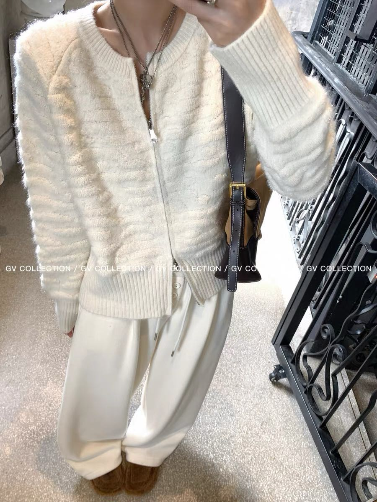

# 款7 麻花拉链针织开衫 · 操作单

> 打版日期：______ | 打版师：______ | 定价：¥89

## 📷 参考图


---

## 1. 基础信息

| 项目 | 内容 |
|------|------|
| 款号 | 07 |
| 款式名 | 麻花拉链针织开衫 |
| 品类 | 基础升级 |
| 定价 | ¥89 |
| 季节 | 秋冬 |
| 穿着方式 | 单穿 / 叠穿打底 |
| 风格 | 韩系极简慵懒都市 |

---

## 2. 尺码尺寸表（单位：cm）

| 部位 | S | M | L | 公差 |
|------|:--:|:--:|:--:|:--:|
| 衣长（肩点→下摆） | 55 | 58 | 61 | ±1 |
| 胸围（腋下平铺×2） | 94 | 100 | 106 | ±2 |
| 肩宽 | 39 | 42 | 45 | ±1 |
| 袖长（肩点→袖口） | 60 | 62 | 64 | ±1 |
| 袖肥（腋下宽） | 32 | 34 | 36 | ±1 |
| 袖口宽 | 8 | 8.5 | 9 | ±0.5 |
| 下摆宽 | 45 | 48 | 51 | ±1 |
| 下摆罗纹高 | 7 | 7 | 7 | ±0.5 |
| 领高 | 7 | 7.5 | 8 | ±0.5 |
| 领围 | 38 | 40 | 42 | ±1 |
| 拉链长 | 48 | 50 | 52 | — |
| 适合身高 | 155-162 | 160-168 | 165-173 | — |
| 适合体重(kg) | 40-48 | 48-55 | 55-62 | — |

---

## 3. 针法排布

| 部位 | 针法 | 针距 | 备注 |
|------|------|:--:|------|
| 前片左 | 6针麻花 × 2条 + 平针 | 12G | 麻花间距3cm，距门襟5cm |
| 前片右 | 同左，镜像对称 | 12G | |
| 后片 | 平针 | 12G | |
| 左袖 | 平针，袖中1条麻花 | 12G | 袖山接前片麻花延伸 |
| 右袖 | 同左 | 12G | |
| 领 | 1×1 罗纹 | 14G | 双层加厚，防卷边 |
| 前门襟 | 1×1 罗纹 | 14G | 宽3cm，拉链内贴 |
| 袖口 | 1×1 罗纹 | 14G | 高5cm |
| 下摆 | 2×2 罗纹 | 12G | 高7cm |

```
前片针法示意：
┌─────────────────────┐
│  ▓▓▓▓  ▓▓▓▓        │ ← 麻花×2（6针）
│  ▓▓▓▓  ▓▓▓▓        │
│  ░░░░░░░░░░░░░░░░  │ ← 平针打底
│                     │
│  拉链 ← 门襟 →      │
│                     │
│  ░░░░░░░░░░░░░░░░  │
│  ▓▓▓▓  ▓▓▓▓        │
│  ▓▓▓▓  ▓▓▓▓        │
└─────────────────────┘
```

---

## 4. 纱线采购单

| 色号 | 颜色名 | 支数 | 成分 | M码用量/件 | 首批4色×3码=12件用量 |
|------|------|:--:|------|:--:|------|
| CL-01 | 奶油白 | 48S/2 | 30%羊毛 70%腈纶 | 350g | 4.2kg |
| CL-02 | 大象灰 | 48S/2 | 30%羊毛 70%腈纶 | 350g | 4.2kg |
| CL-03 | 可可棕 | 48S/2 | 30%羊毛 70%腈纶 | 350g | 4.2kg |
| 🆕 SG-01 | 鼠尾草绿 | 48S/2 | 30%羊毛 70%腈纶 | 350g | 4.2kg |
| **合计** | 4色 | | | | **16.8kg** |

> ⚠️ 鼠尾草绿需先打色卡确认，明天对色

---

## 5. 辅料清单

| 辅料 | 规格 | 每件用量 | 首批12件用量 | 备注 |
|------|------|:--:|------|------|
| 金属拉链 | 3.5cm宽细齿，50cm长 | 1条 | 12条 | 圆头简约款，色同门襟 |
| 主唛 | TEMPL 玄 | 1个 | 12个 | 后领中 |
| 洗水唛 | 成分+洗护 | 1个 | 12个 | 左侧缝 |
| 吊牌 | 品牌吊牌 | 1套 | 12套 | 含价格标 |
| 包装袋 | 品牌自封袋 | 1个 | 12个 | |

---

## 6. 工艺要点

| 工序 | 要点 | 注意事项 |
|------|------|------|
| 织片 | 前片麻花左右对称 | 麻花4行一绞，不要太紧 |
| 套口 | 肩缝平接，侧缝锁边 | 针距1cm 4针 |
| 上拉链 | 先熨平门襟，再车拉链 | 拉链头距领口0.5cm |
| 上领 | 领罗纹双层对折 | 先套口再手工缝合内侧 |
| 洗水 | 轻柔洗，平铺晾干 | 温度≤30°C，不要甩干 |
| 整烫 | 低温蒸汽熨 | 麻花部位垫布，别压平 |

---

## 7. 质检项

| 检查项 | 标准 | ✅ |
|------|------|:--:|
| 左右麻花对称 | 偏差≤0.5cm | ⬜ |
| 拉链顺滑 | 来回拉10次无卡顿 | ⬜ |
| 领口不卷边 | 平铺领口自然贴服 | ⬜ |
| 无跳针漏针 | 全件检 | ⬜ |
| 无线头 | 修剪干净 | ⬜ |
| 尺寸公差 | 对照尺码表±1cm内 | ⬜ |
| 色差 | 同色件无色差 | ⬜ |
| 手感 | 软糯不扎 | ⬜ |

---

## 8. 工时预估

| 工序 | 单件时间 |
|------|:--:|
| 织片（电脑横机） | 40min |
| 套口 | 25min |
| 上拉链 | 10min |
| 上领 | 8min |
| 洗水烘干 | 30min |
| 整烫包装 | 12min |
| **单件合计** | **约2h** |

---

> 📁 文件位置：`/home/ubuntu/周周/2026开发素材库/已入线款式/款7_麻花拉链开衫/操作单.md`
